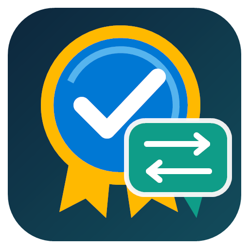

<p align="center">
  
</p>

# Steam 成就翻译安装器

一款面向 Windows 10/11 的 Steam 成就翻译管理工具。它可以自动找到本机游戏，从社区翻译库选择合适版本，并安全完成安装、状态检查与恢复。

[](https://github.com/GaBoron/steam-achievement-translation-installer/releases/latest)
[](#系统要求)
[](LICENSE)

## 下载与安装

请只从 [GitHub Releases](https://github.com/GaBoron/steam-achievement-translation-installer/releases/latest) 下载。

| 版本 | 适合谁 | 使用方法 |
| --- | --- | --- |
| `SATLInstaller-Setup-v0.4.0.exe` | 大多数用户，推荐 | 运行安装程序，之后从开始菜单打开 |
| `SATLInstaller-Portable-v0.4.0.zip` | 不想安装或需要随身携带 | 解压完整 ZIP，再运行 `SATLInstaller.exe` |

安装版和便携版功能相同。便携版不能只单独复制 EXE，必须保留解压后的全部文件。

本项目暂未提供代码签名。Windows SmartScreen 可能首次显示安全提醒；请核对下载来源和 Release 中的 SHA-256 后再运行。

## 三步开始使用

1. 打开软件，等待它扫描本机 Steam 游戏。
2. 勾选需要翻译的游戏，确认翻译版本。
3. 点击“安装所选”，检查计划并确认执行。

“已管理”页面会显示 SATL 管理的游戏、当前状态和已安装版本。需要撤销时可恢复安装前文件；如果文件之后被其他程序修改，软件会先拒绝普通恢复，只有在你明确确认后才执行强制恢复并归档当前文件。

## 主要功能

- 自动检测 Steam 目录和本机成就缓存。
- 搜索、批量选择并安装社区翻译。
- 支持同一游戏的多个翻译版本。
- 显示已安装版本、正常、缺失或被修改等状态。
- 安装前备份，支持普通恢复和确认后的强制恢复。
- 在线刷新翻译目录，也可使用离线缓存。
- 浅色、深色和跟随系统主题。
- 普通、详尽与临时 Debug 日志，支持保留期限和日志目录管理。
- 从 GitHub Releases 检查新版本，并打开官方发布页下载。
- 为尚未收录的游戏导出符合仓库要求的原始 schema ZIP，并直达翻译请愿表单。

翻译数据来自 [Steam 成就翻译库](https://github.com/GaBoron/steam-achievement-translation-library)。安装器不会编辑翻译内容，也不会把你的 Steam 文件上传到网络。

## 翻译请愿

搜索页的“未找到游戏？”按钮会打开“翻译请愿”对话框：

1. 从 Steam 商店地址中找到 `/app/` 后的数字，并填入 Steam App ID。
2. 点击“导出”，选择保存位置。软件会自动查找原始 `UserGameStatsSchema_<app_id>.bin`，并生成只含该文件的同名 ZIP。
3. 点击“提交请愿”打开翻译库表单，填写游戏名、商店地址和目标语言，再上传刚导出的 ZIP。

导出过程不会修改 Steam 文件；写入采用临时文件、内容校验和原子替换，失败时不会留下不完整 ZIP。如果没有找到原始文件，请先启动对应游戏并让 Steam 读取一次成就。

## 更新检查

“设置 → 软件更新”可以手动检查更新；启动检查默认开启，也可以随时关闭。软件只读取本项目公开的 GitHub Release 信息：

- 有新版本时显示版本号，并提供官方 Release 下载页。
- 没有新版本时显示当前已是最新版。
- 不会在后台静默下载、替换或执行安装程序。

如果无法访问 GitHub，更新检查失败不会影响扫描、安装或恢复功能。

## 数据与日志

默认数据目录：

```text
%LOCALAPPDATA%\SteamAchievementTranslationInstaller\
```

这里会保存设置、目录缓存、安装状态、备份、恢复归档和可选运行日志。日志不记录成就文件正文。你可以在设置中关闭日志、调整保留时间，并选择记录级别：

- “普通”记录操作结果与错误。
- “详尽”额外记录 CLI 事件。
- “Debug”用于复现软件问题，会逐步记录操作参数、CLI 原始事件、耗时、标准错误和完整异常。它可能包含本机目录、Steam 路径、App ID、游戏名等诊断信息，也会增加日志体积并带来轻微性能开销。

每次开启 Debug 都必须在 WinUI 警告对话框中再次确认。Debug 仅对当前运行有效，关闭并重新打开软件后会自动恢复为“详尽”；向他人发送日志前请先检查并移除不希望分享的信息。

## 系统要求

- Windows 10 版本 2004（Build 19041）或更高版本，推荐 Windows 11。
- x64 处理器。
- 已安装 Steam；使用离线缓存时可暂时不联网。

发布包包含所需的 .NET、Windows App SDK 与 Python 官方嵌入式运行文件，无需另外安装运行库。

## 常见问题

### 没有扫描到游戏

先启动 Steam 和对应游戏一次，让 Steam 生成成就缓存；也可以在设置中手动选择 Steam 目录，然后重新扫描。

### 安装后翻译消失

Steam 或游戏更新可能重新生成成就缓存。重新扫描后再次安装即可；如果翻译库条目已经过期，请前往翻译库报告。

### 为什么恢复被拒绝

目标文件在安装后被修改。为避免覆盖其他程序或 Steam 的新数据，普通恢复会停止。确认文件确实可以替换后，再使用带二次确认的强制恢复。

### 资源管理器仍显示旧图标

Windows 可能缓存相同路径的旧 EXE 图标。请删除旧解压目录，并把新版便携包解压到新文件夹。

## 相关项目

- [Steam 成就翻译库](https://github.com/GaBoron/steam-achievement-translation-library)：查找和提交社区翻译数据。
- [Steam Achievement Localizer Skill](https://github.com/GaBoron/steam-achievement-localizer-skill)：使用 Codex 辅助制作与审核翻译。
- [SteamAchievementLocalizer](https://github.com/PanVena/SteamAchievementLocalizer)：本地可视化翻译编辑器。

## 开发与构建

普通用户不需要执行本节。

开发环境需要 Windows 10/11 x64、Python 3.13、.NET 10 SDK、WinUI 3 工具链和 Inno Setup 6。

```powershell
python -m venv .venv
.\.venv\Scripts\pip.exe install -e ".[dev]"
powershell -ExecutionPolicy Bypass -File .\scripts\build.ps1
```

构建结果位于 `dist\release\`：安装版 EXE、便携版 ZIP 和 `SHA256SUMS.txt`。

命令行高级用法可运行：

```powershell
satl --help
```

## 许可证

程序代码采用 [MIT License](LICENSE)。第三方组件和翻译数据的权利说明见 [THIRD_PARTY_NOTICES.md](THIRD_PARTY_NOTICES.md)。
